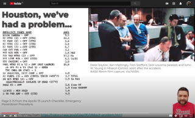

# Felix Ulrich-Oltean
Working on translating Constraint Satisfaction Problems into Boolean
SAT problems with the help of machine learning to choose the best
encoding.

## Get in touch
* E-mail me: fvuo500 at york dot ac dot uk
* Tweet me: [FelixVuo](https://twitter.com/FelixVuo)
* Hire me: [LinkedIn](https://www.linkedin.com/in/felix-ulrich-oltean/)

## 2020, July and September, CP2020 Doctoral Programme
As part of the doctoral programme at the [CP2020 conference on
Constraint Progamming](https://cp2020.a4cp.org/), I have submitted a
short paper to describe my research so far and have taken part in
peer-review with other PhD students, going through the EasyChair
platform to submit, review, discuss.

At the conference I will give a 10-minute presentation about my
research topic.  I hope to share more details here soon.

## 2020, June, Eastern European Machine Learning Summer School
 I'm
very pleased to be attending this summer school in July (shame it
couldn't be in the flesh in Warsaw).  As part of the application /
registration process I prepared a short video presentation to
summarise my research interest.  [Watch it
here](https://youtu.be/SyihWz34KEw)

## 2020, January, AI Group Seminars
I have taken over the organisation of the AI seminars in our
department - looking forward to hearing all about what colleagues have
been up to in their research.

## 2019, December, Literature Review Seminar
This is my first presentation as a PhD research student, given in
month 3 of the programme.  [View it
live](litreview/lrseminar.sozi.html) on a 16:9 screen, with thanks to
the amazing [Sozi Project](https://sozi.baierouge.fr/).

[Here is the accompanying script](litreview/script.pdf) for the
presentation and the [toy problem](litreview/treeproblemprintout.pdf)
given out at the start.
