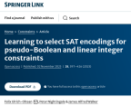
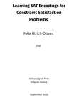

Working on solving Constraint Satisfaction Problems with the help of Machine
Learning techniques.

## Get in touch
* E-mail me: felix.ulrich-oltean at york dot ac dot uk
* Tweet me: [FelixVuo](https://twitter.com/FelixVuo)
* Hire me: [LinkedIn](https://www.linkedin.com/in/felix-ulrich-oltean/)

## 2023, November, First-author Journal Article Published
Our paper [Learning to select
SAT Encodings for pseudo-Boolean and linear integer
constraints](https://doi.org/10.1007/s10601-023-09364-1) has now been published
in the Constraints journal.  This paper was an extended version of the work
presented at CP2022, with more encodings, more analysis and the first detailed
description of Savile Row's Tree SAT encoding.  The expanded results, models and
code are now at https://github.com/felixvuo/lease-data

## 2023, October, Guest Lecture in AI Masters Course
It was great to be back in front of a class, this time delivering a lecture on
logic and inference to Masters students taking the FOAM (Foundations of
Artificial Intelligence and Machine Learning) course at the University of York.

## 2023, September, Thesis Submitted
 What a
relief to finally submit my PhD thesis after four eventful years.  I'm looking
forward to picking up some of the research projects which were on hold while the
write-up was completed.  And of course awaiting the viva!

## 2022, September, Research Associate Position
I have been hired by the University of York to work as a research associate with
Peter Nightingale in the field of constraint programming, initially part-time as
I finish working on my PhD.

## 2022, August, Presenting Paper at CP2022 in Haifa
I was thrilled that our paper
[Selecting SAT Encodings for Pseudo-Boolean and Linear Integer
Constraints](https://eprints.whiterose.ac.uk/186734/1/) was accepted to CP2022,
and even shortlisted for the best paper award.
- Experimental data including constraint models and results are available at
  https://github.com/felixvuo/cp2022-pbli-sat
- [Poster](./papers/poster-cp2022-dp.pdf) presented at the Doctoral Programme.

## 2021, October, CP2021 Doctoral Programme and ModRef Workshop
 I am presenting my work in two
guises: as part of the doctoral programme and also to the ModRef2021 workshop.
You can get the slides and (pre)recording of the talks here:
- ModRef talk: [slides](papers/slides-modref2021.pdf), [YouTube
  recording](https://youtu.be/jWLN0H7FX_I)
- Doc Prog : [slides](papers/slides-cp2021-dp.pdf), [YouTube
  recording](https://youtu.be/tV576cKgt5w)

## 2021, September, Associate Fellow of the HEA
After completing the [York
Professional and Academic Development scheme
(YPAD)](https://www.york.ac.uk/staff/teaching/develop/ypad/) and submitting a
report of my teaching-related experience I was awarded Associate Fellowship of
the Higher Education Academy.  As part of my report I carried out a brief
investigation into using summative assessment results to inform teaching and
assessment in the next cohort.  Per-question breakdown of the marks allows some
rudimentary statistical analysis which can shed light on how questions coudl be
improved or which concepts and skills might be particularly difficult for
students.

## 2021, August, The Bookshelves Problem
It was
great to submit an optimisation problem to the [CSPLib](https://csplib.org) web
site.  It started with [this
tweet](https://twitter.com/FelixVuo/status/1343913107966603264) and it was fun
to connect a real-life hands-on project with some constraint programming.  The
full problem specification, and model files are
[here](https://www.csplib.org/Problems/prob085/).

## 2021, June, GTA of the Year Award
 I was very honoured to receive
this award after being a graduate teaching assistant, working particulary to
help year 1 students with maths (after lockdown had deprived them of months of
A-level maths), and also running some data science labs remotely.

## 2020, July and September, CP2020 Doctoral Programme
 As part of the doctoral programme at the [CP2020 conference on Constraint
Progamming](https://cp2020.a4cp.org/), I submitted [a short paper to describe my
research so far](./papers/cp2020-docprog-research_summary.pdf) and took part in
peer-review with other PhD students, going through the EasyChair platform to
submit, review, discuss.

At the conference I gave a 10-minute presentation about my research topic.  You
can access the [slides here](papers/cp2020-docprog-slides.pdf) and [watch the
presentation here](https://youtu.be/ZoMjX8tGEiA).

## 2020, June, Eastern European Machine Learning Summer School
 I'm very pleased to be attending this
summer school in July (shame it couldn't be in the flesh in Warsaw).  As part of
the application / registration process I prepared a short video presentation to
summarise my research interest.  [Watch it here](https://youtu.be/SyihWz34KEw)

## 2020, January, AI Group Seminars
I have taken over the organisation of the AI seminars in our department -
looking forward to hearing all about what colleagues have been up to in their
research.

## 2019, December, Literature Review Seminar
This is my first presentation as a PhD research student, given in month 3 of the
programme.  [View it live](litreview/lrseminar.sozi.html) on a 16:9 screen, with
thanks to the amazing [Sozi Project](https://sozi.baierouge.fr/).

[Here is the accompanying script](litreview/script.pdf) for the presentation and
the [toy problem](litreview/treeproblemprintout.pdf) given out at the start.
